${meta({
	title: "contribute"
})}

Please [contribute](https://github.com/svidgen/www.thepointless.com). Help us write professional looking code and content to equal the best on the interwebs.

For example:

```js
const content = write({
	seed: Math.random(),
	style: CONTENT_STYLES.BEST,
	hasPoint: false
});
```

*Not to mention fancy diagrams like this:*

```mermaid
graph LR;
	subgraph The Beginning;
		a(a) --> b(b);
		b --> c(c);
	end;
	subgraph The End;
		x --> y(y);
		y --> z(z);
	end;
	c --> etc("... 🌪️ ...");
	etc --> x;
```



*Beep. Boop. Bop.*

We use [ex-gratia](https://github.com/svidgen/ex-gratia/blob/main/contributors-guide.md) to share our ad space our contributors. So, your contributions can not only give you experience and bragging rights, they can help generate traffic and make you money!

Woohoo!
