${meta({
	title: "contribute"
})}

Help make a difference, friend. [Contribute](https://github.com/svidgen/www.thepointless.com) your code, your content, and your cookies. Come write the most professional looking code and content of the all the interwebs.

For example:

```js
const content = write({
	seed: Math.random(),
	style: CONTENT_STYLES.BEST,
	hasPoint: false
});
```

*Not to mention fancy diagrams like this:*

```mermaid
graph LR;
	subgraph The Beginning;
		a(a) --> b(b);
		b --> c(c);
	end;
	subgraph The End;
		x --> y(y);
		y --> z(z);
	end;
	c --> etc("🌪️");
	etc --> x;
```



*Beep. Boop. Bop.*

More computer noises.