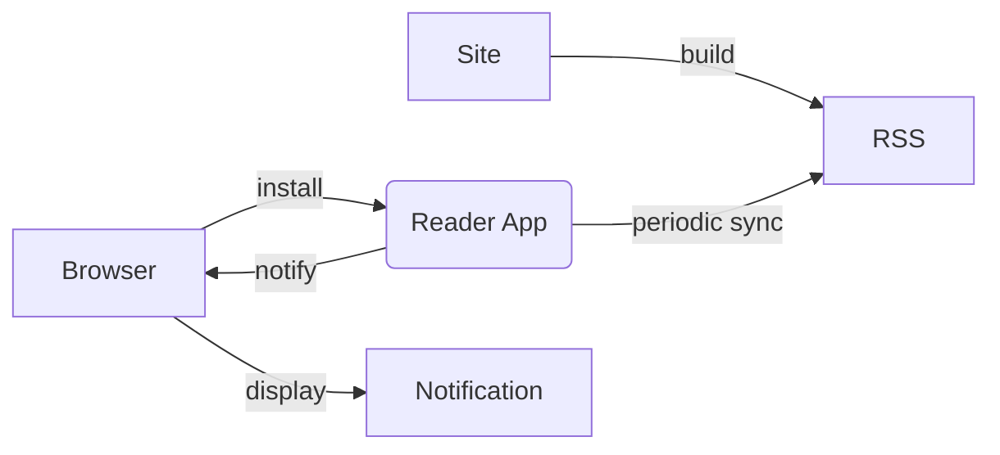

${meta({
	title: "Notifier Test",
})}
${manifest()}

This page is a test of the [Notifications API](https://developer.mozilla.org/en-US/docs/Web/API/Notifications_API) and [Periodic Sync API](https://developer.mozilla.org/en-US/docs/Web/API/Web_Periodic_Background_Synchronization_API) as a possible mechanism for our visitors to subscribe to news and updates from us. The idea would be to publish an RSS feed and supply a little RSS reader app that subscribes to our own feed by default. And of course, the feed could subscribe to any app that supports CORS out of the box &mdash; and probably non-CORS feeds for a small fee. 💸



When I first started tinkering with this, I had assumed this API was ubiquitous at this point. But, *it's not!* As of 2022-05-30, [the Notifications API is not supported in Mobile Safari](https://developer.mozilla.org/en-US/docs/Web/API/Notification/Notification#browser_compatibility), and ([Periodic Background sync](https://developer.mozilla.org/en-US/docs/Web/API/Web_Periodic_Background_Synchronization_API#browser_compatibility)) is not supported in Mobile Safari *or Firefox*.

So, if you're on Mobile Safari, this demo won't work for you *at all*. If you're in Firefox, the background notifications portion won't work.

### For the rest of the world ...

The notifications interface is pretty straightforward. A notification can be triggered by requesting permissions and then creating a new \`Notification\` object. A basic \`Notification\` can include a title, icon, and message body. Notifications triggered from a service worker can also include actions!

```js
this.requestButton.onclick = () => {
	Notification.requestPermission().then(() => {
		if (Notification.permission === 'granted') {
			alert('Thanks!\\nYou can issue a notification now.');
		} else {
			alert('Oh no!\\nDid you really mean to block notifications???');
		}
	});
};

this.notifyButton.onclick = () => {
	if (Notification.permission === 'granted') {
		const notification = new Notification("Title Goes Here", {
			body: "More details can go in the body of the notification. You can also specify an icon.",
			icon: "/images/favicon.ico"
		});
	} else {
		alert("Notifications can't be tested until you Request + Grant permission.\\n(You can revoke permissions later.)")
	}
};
```

<div>
	<tpdc:notificationtest></tpdc:notificationtest>
	<tpdc:subscribe></tpdc:subscribe>
</div>


Full source for this example is in [the repo on Github](https://github.com/svidgen/www.thepointless.com/blob/master/src/routes/experimental/notifier/).


<script src='index.js'></script>